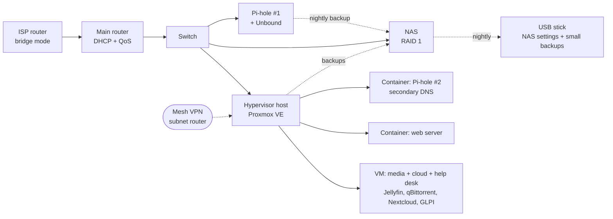

# Homelab v2

A documented self-hosted homelab build: virtualization, a NAS, network-wide ad-blocking with redundant DNS, monitoring, a personal cloud, a help desk, remote access and backups. All of it runs on consumer-grade secondhand and retail hardware, no enterprise gear.

Built and documented by SuperDidZero (PC Build PT). This is the second iteration of the homelab. The first, `personal-hardware-lab`, is archived. This one is written up properly so the choices, the mistakes and the fixes are all somewhere other people can actually use them.

All IP addresses, hostnames, API keys and passwords in these docs are **placeholders**. Swap them for your own network's values; nothing here will work by copy-pasting the addresses as-is.

## What's actually in here

| Doc | Covers |
|---|---|
| [docs/hardware.md](docs/hardware.md) | The physical build: rack, hypervisor host, NAS, Pi-hole box, UPS, and why each thing was picked |
| [docs/network.md](docs/network.md) | Topology, DNS/ad-blocking with Pi-hole (primary + secondary), remote access over Tailscale |
| [docs/proxmox.md](docs/proxmox.md) | The Proxmox VE host: what runs where, and the two hardware/config gotchas that actually caused outages |
| [docs/web-server.md](docs/web-server.md) | A small nginx container, and what it ended up being useful for |
| [docs/nextcloud.md](docs/nextcloud.md) | The personal cloud: Nextcloud in Docker with its data on the NAS |
| [docs/help-desk-and-remote-support.md](docs/help-desk-and-remote-support.md) | A self-hosted ticketing system, and remote control of a Windows laptop from inside and outside the house |
| [docs/backups.md](docs/backups.md) | What gets backed up, how, how often, and how restores are actually tested |
| [docs/dashboard-and-monitoring.md](docs/dashboard-and-monitoring.md) | Homepage dashboard + Uptime Kuma + alerting, so there's one screen that shows if anything's down |
| [docs/incidents.md](docs/incidents.md) | Every outage and odd failure so far, in date order: symptom, cause, fix |
| [docs/build-log.md](docs/build-log.md) | The build day by day, from the first shelf to the current state |
| [docs/lessons-learned.md](docs/lessons-learned.md) | What got ruled out and why, and the principles that guided the build |

## Rough shape of the thing

## Why this is public

The point isn't that anyone needs this exact stack. Most homelab write-ups either stop at "I installed Proxmox" or only show the finished, working version. This one keeps the actual failures in: a NIC that silently hung under load, a dashboard that refused outside connections until one environment variable was added, a container update tool that broke because its upstream project was abandoned, a NAS that claimed it had no internet. Those are the parts that are actually useful to someone hitting the same wall.

## Still open

Written down on purpose, so the repo doesn't read as more finished than it is:

- The restore test for the DNS box's nightly backup has not been run yet.
- There is no full second copy of the NAS outside the NAS. Media and the machine backups exist in one place only.
- A firewall VM, VLANs and a home automation VM are planned and not started.
- No photos or screenshots in this repo yet.

## Related

- [command-console](https://github.com/superdidotwitch-jpg/command-console): a sci-fi dashboard UI built as a front end for a personal daily brief.
- [powershell-toolkit](https://github.com/superdidotwitch-jpg/powershell-toolkit): the small Windows health, hardening-check and cleanup scripts used on the laptop mentioned in the remote support doc.
- [esp32-mp3-player](https://github.com/superdidotwitch-jpg/esp32-mp3-player): the DIY electronics build that lives next to this homelab.

## License

MIT. Do whatever you want with it.
