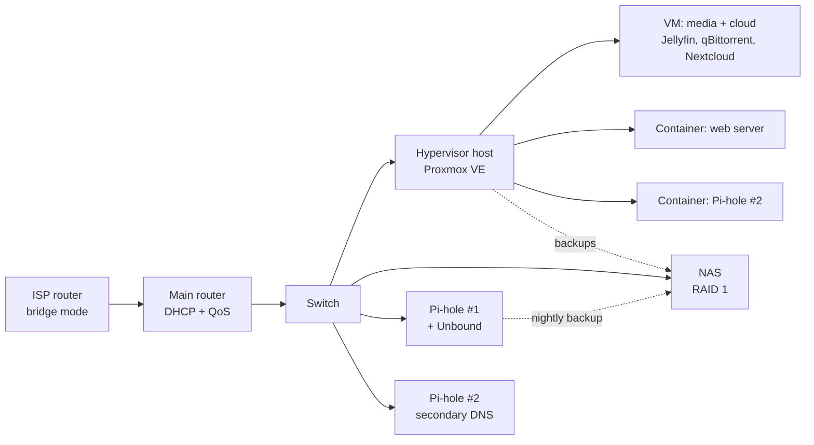

# Homelab v2

A documented self-hosted homelab build: virtualization, a NAS, network-wide ad-blocking with redundant DNS, monitoring, a personal cloud, and backups — all running on consumer-grade secondhand/retail hardware, no enterprise gear.

Built and documented by SuperDidZero (PC Build PT). This is the second iteration of the homelab — the first, `personal-hardware-lab`, is archived — written up properly this time so the choices, the mistakes, and the fixes are all somewhere other people can actually use them.

All IP addresses, hostnames, API keys and passwords in these docs are **placeholders**. Swap them for your own network's values; nothing here will work by copy-pasting the addresses as-is.

## What's actually in here

| Doc | Covers |
|---|---|
| [docs/hardware.md](docs/hardware.md) | The physical build: rack, hypervisor host, NAS, Pi-hole box, UPS, what each thing cost and why it was picked |
| [docs/network.md](docs/network.md) | Topology, DNS/ad-blocking with Pi-hole (primary + secondary), remote access over Tailscale |
| [docs/proxmox.md](docs/proxmox.md) | The Proxmox VE host: what runs where, and the two hardware/config gotchas that actually caused outages |
| [docs/backups.md](docs/backups.md) | What gets backed up, how, how often, and how restores are actually tested |
| [docs/dashboard-and-monitoring.md](docs/dashboard-and-monitoring.md) | Homepage dashboard + Uptime Kuma + alerting, so there's one screen that shows if anything's down |
| [docs/lessons-learned.md](docs/lessons-learned.md) | What got ruled out and why, and the principles that guided the build |

## Rough shape of the thing

## Why this is public

The point isn't that anyone needs this exact stack — it's that most homelab write-ups either stop at "I installed Proxmox" or only show the finished, working version. This one keeps the actual failures in: a NIC that silently hung under load, a dashboard that refused outside connections until one environment variable was added, a container update tool that broke because its upstream project was abandoned. Those are the parts that are actually useful to someone hitting the same wall.

Related: [command-console](https://github.com/superdidotwitch-jpg/command-console) — a sci-fi dashboard UI built as a front end for a personal daily brief, separate project, same author.

## License

MIT. Do whatever you want with it.
