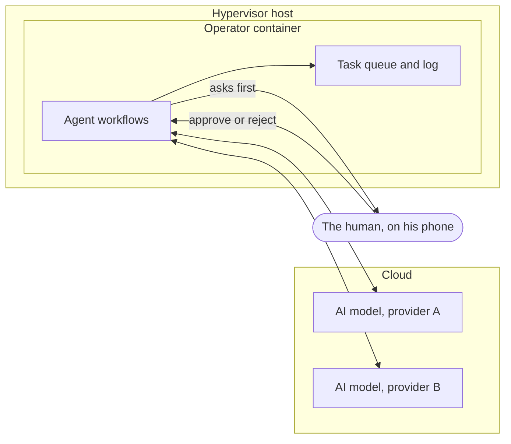

# AI operator (planned)

The next thing this homelab is for: one small machine that coordinates several AI agents doing real work for a small business. This page describes the shape of it. It does not describe what the agents do. That part is the business, and it stays private.

**Status: designed and approved, not built yet.** This page is updated as each part goes live, including the parts that go wrong.

## The idea in one paragraph

AI agents are useful one at a time. They get much more useful when something keeps track of who is doing what, passes results from one to the next, and stops for a human before anything leaves the building. That something is the operator. It is not an AI itself. It is the desk the work passes over.

## Where it runs

- **One small container on the existing hypervisor.** 2 cores and 2 GB of memory. No new hardware and no computer per agent.
- **The models run in the cloud.** The mini PC does not run any AI model. It only coordinates, stores and logs. A six year old office mini PC is plenty for that.
- **More than one provider.** The operator is not tied to a single AI company. Each agent uses whichever model suits its job.
- **Its own container, on purpose.** It will hold API keys and, later, some authority over the homelab. That does not belong on the same machine as the media server and the torrent client.
- **Backed up for free.** The weekly backup job already covers every machine on the hypervisor, so the operator is included from its first Sunday.

## The pieces

| Piece | What it is |
|---|---|
| Workflow engine | n8n in Docker. Browser based, so agents are built by connecting boxes, not by writing a framework |
| An agent | One workflow with one clearly defined job |
| Task queue | One built-in table: task, agent, status, authority level, result. It is also the central view and the duplicate check |
| Log | The engine's own run history. Every run, every step, kept |
| Approvals | A chat bot message with the proposed action and two buttons. The workflow waits until one is pressed |

## Authority levels

Every task carries one of five levels, and the level decides what the agent is allowed to do with its result.

| Level | The agent may | A human |
|---|---|---|
| 1. Research | Look things up and report | Reads the report |
| 2. Prepare | Research and draft a proposed action | Reviews the draft |
| 3. Execute with approval | Prepare, then act | Must approve first, every time |
| 4. Autonomous | Act alone, on a short list of trusted tasks | Reads the log |
| 5. Infrastructure | Touch the homelab: servers, network, files, deployments | Strict approval, shown the exact action |

Two design choices make these real and not just labels:

- **A research workflow has no "do" step in it at all.** It cannot act, because the part that would act was never built.
- **Level 5 starts with no access.** The operator begins with no credentials for anything in the homelab. Access gets added one narrow piece at a time, when a specific task needs it.

## What was left out, and why

The first plan was bigger: a Kubernetes cluster with a manager agent on top. It was cut down before anything was built.

- **No Kubernetes.** One container does not need a cluster. The cluster stays on the "later" list for when there is something to schedule.
- **No separate database.** The engine's built-in table is enough for a task queue at this size.
- **No agent framework.** A framework is one more thing to learn, update and debug. Workflows with defined steps cover the need.
- **No free-roaming agents.** Agents review each other's work, but as defined steps in a workflow, not as a room full of bots talking. That is the version one person can still understand and fix six months later.

The rule the whole design follows: nothing gets added because it is available. Each piece has to be explained before it goes in.

## Build order

1. Create the container.
2. Install the workflow engine.
3. Create the task table.
4. Connect one test agent at the Research level.
5. Wire in the approval step and prove a task can pause, wait for a yes, and continue.
6. A tile on the dashboard and a monitor in Uptime Kuma, like every other service here.

Real work only starts after step 5 works end to end.
