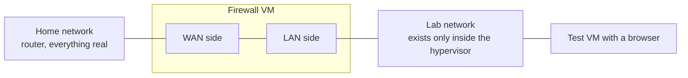

# Firewall lab (OPNsense)

A firewall built as a virtual machine, with its own private lab network behind it. Nothing about the real home network changes: the home router still does its job, and the firewall treats the home network as its "internet side".

## Why OPNsense and not pfSense

The plan said pfSense. Its installer now sits behind a free account on its maker's store. OPNsense started from the same code, downloads as a plain file with no sign-up, and teaches the same things: WAN and LAN, rules, DHCP, NAT. So OPNsense it was.

## The layout

- **Lab network:** a second Linux bridge on the Proxmox host with no physical port attached. Machines on it can only talk to each other.
- **Firewall VM:** 2 cores, 2 GB of memory, 16 GB disk, two network cards. One on the lab bridge (LAN), one on the normal bridge (WAN).
- **Test computer:** the spare "experiments" desktop VM, moved onto the lab bridge. It gets its address from the firewall and reaches the internet through it.

## Build order, and the one rule that matters

A firewall hands out addresses on its LAN side from its very first boot. If that side were plugged into the real home network by mistake, it would start answering real devices and break things.

So the VM was created with **only the lab network card**. It was installed and booted like that, and the console confirmed LAN was on the lab side. Only then was the second card added, on the home network, and assigned as WAN by hand from the console menu. The order makes the dangerous mistake impossible instead of merely unlikely.

1. Create the lab bridge on the hypervisor. Check the pending network changes before applying, to be sure earlier hand-made fixes in that file survive.
2. Let the hypervisor download the installer image and unpack it.
3. Create the VM with one network card, on the lab bridge.
4. Install from the console. Leave the default password for now.
5. Shut down, add the second card on the home bridge, boot, and assign WAN and LAN in the console menu. Read the summary before confirming.
6. Move the test VM onto the lab bridge and open the firewall's web page from its browser.
7. Run the setup wizard: timezone, WAN by DHCP, LAN left at its default range, new password.

## Settings worth explaining

- **"Block private networks" on WAN: off.** That option drops anything arriving on the outside from private address ranges. On a real internet line that is right. Here the outside *is* a private network, so it would block the network the firewall is plugged into.
- **LAN range left at the default.** It does not overlap with the home network's range, which is what makes routing between the two work.

## The first rule

Out of the box, a computer in the lab could reach the internet and also everything on the home network. The first is wanted. The second is exactly what a lab should not be able to do.

| Field | Value |
|---|---|
| Action | Reject |
| Interface | LAN |
| Direction | in |
| Source | LAN network |
| Destination | the home network's range |
| Position | above the default "allow LAN to anywhere" rule |

**Rules are read top to bottom and the first match wins.** A new rule lands at the bottom, under the allow-everything rule, where it would never be reached. It has to be moved above it.

**Reject, not block.** Reject tells the sender "no" straight away, so a browser fails instantly. Block says nothing and leaves the sender waiting for a timeout. On an inside network, the quick answer is friendlier.

## Testing it, and a result that looked like a failure

After applying the rule:

- A normal website loaded. Internet still works.
- A page on the home network that had been opened a few minutes earlier **still loaded**.
- An address on the home network that had never been visited **failed instantly**.

The second result was not the rule failing. A firewall rule decides about *new* connections. One that was already open before the rule existed is allowed to finish, and the browser also keeps its own saved copy of pages. Testing a rule with something you have already visited tells you nothing. Test with something fresh.

## Small things that cost time

- The hypervisor's "download from URL" box refuses an address with a line break or space in it. Copying from a wrapped line of text picks one up.
- The installer sits at 90% for several minutes. It is copying thousands of small files and is not stuck.
- Clicking into the console during boot counts as "press any key" and opens the configuration importer. Pressing Enter on an empty line leaves it.
- A VM console can send the wrong symbols if the VM's keyboard layout does not match the real keyboard. A colon typed into a browser became a different character and turned an address into a web search. Use letters and digits for the first password, set in the console's world, for the same reason.

## Not done yet

- VLANs on the lab side
- Port forwarding from the home network into the lab
- A second lab machine, to test rules between lab devices
