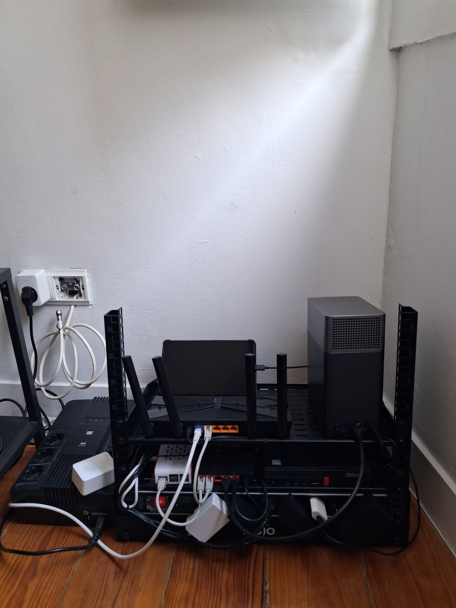
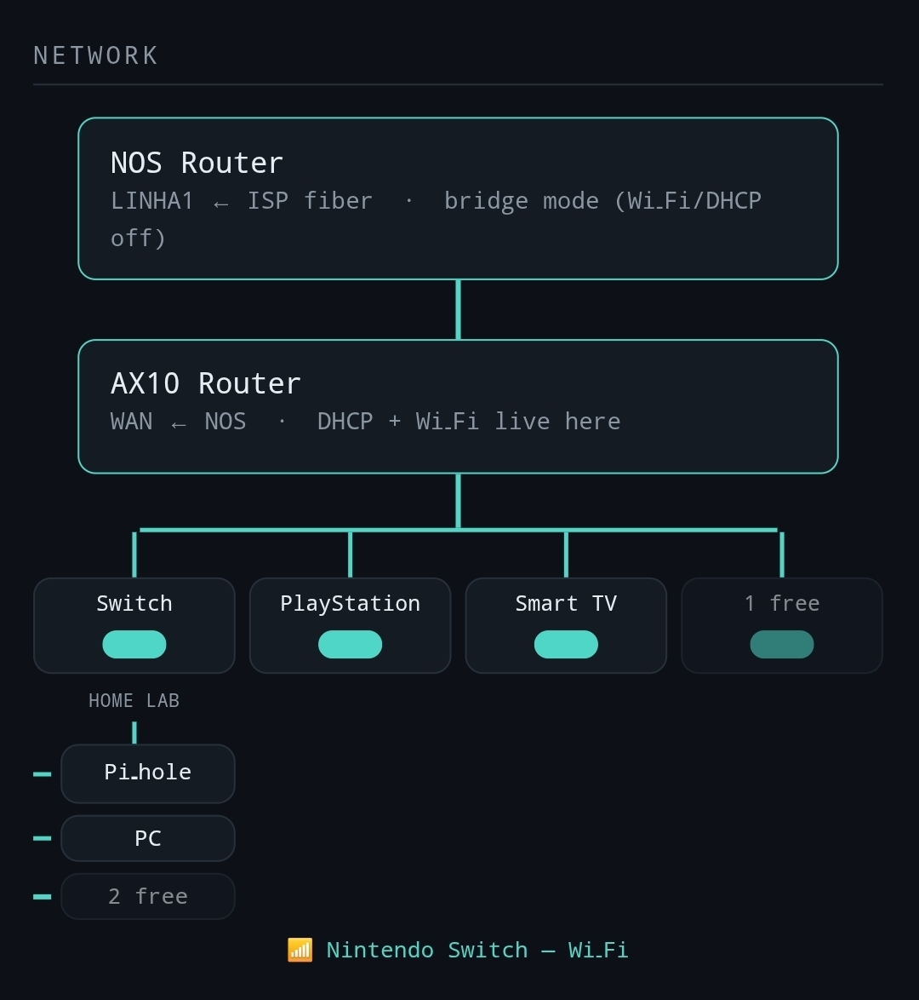
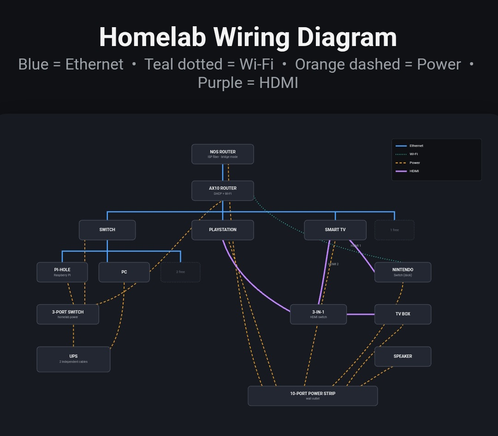
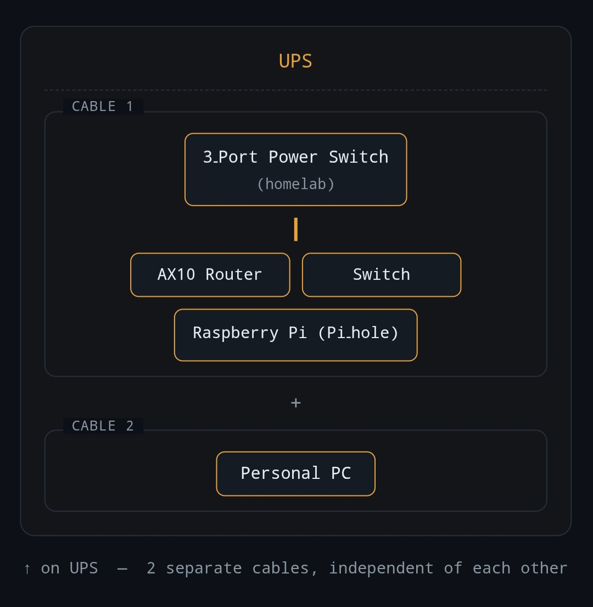
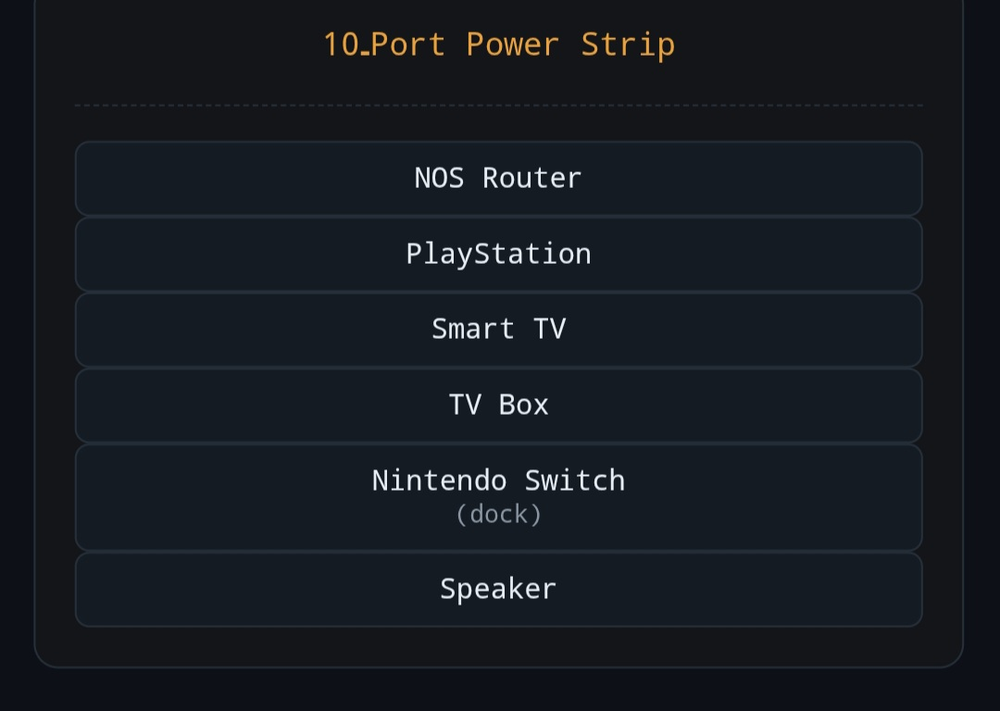
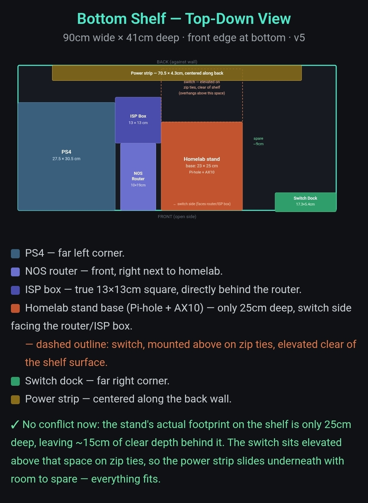

# Photos

Pictures of the real build, plus the planning sketches it started from.

## The rack today

*7 October 2026.* The finished rack. Top shelf: router and NAS. Below: switch, DNS box and the hypervisor mini PC. The UPS sits on the floor to the left, because the shelves are too shallow for it.

## Where it started

These are planning sketches from July 2026, before the rack, the NAS and the hypervisor existed. Back then the whole "homelab" was a router, a switch and one Raspberry Pi on a small stand on the TV shelf. They are here to show the starting point, not the current setup.

*Network plan.* ISP router in bridge mode, main router behind it, and a switch with only the Pi-hole and one PC on it. The topology is the same today, there is just a lot more hanging off the switch.

*Wiring diagram.* Ethernet, Wi-Fi, power and HDMI for everything around the TV.

*UPS plan.* What was on battery backup at the time.

*Power strip plan.* Everything that was not on the UPS.

*Shelf layout.* Fitting it all onto one TV shelf, measured to the centimetre. Running out of room here is part of why the rack happened.

## Still to add

- Close-ups of each shelf
- The dashboard on the tablet
